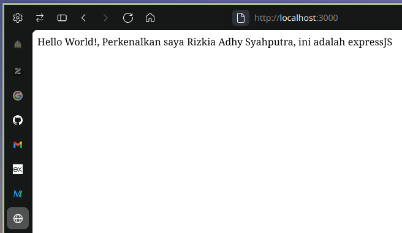
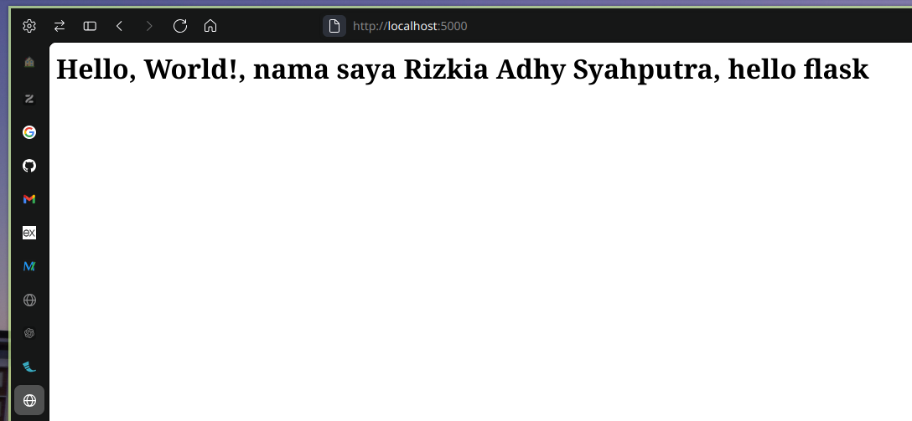

# Backend Framework

#### Nama : Rizkia Adhy Syahputra
#### NIM : 5220411051

# 
- [Backend Framework](#backend-framework)
  - [A. ExpressJs](#a-expressjs)
    - [1. Buat direktori untuk menyimpan kode untuk expressjs](#1-buat-direktori-untuk-menyimpan-kode-untuk-expressjs)
    - [2. Init untuk node package manager](#2-init-untuk-node-package-manager)
    - [3. Install express](#3-install-express)
    - [4. Buat file javascript untuk menampung kode express](#4-buat-file-javascript-untuk-menampung-kode-express)
    - [5. Kode Hello world](#5-kode-hello-world)
    - [6. Running](#6-running)
    - [7. Hasil running](#7-hasil-running)
  - [B. Flask](#b-flask)
    - [1. Buat direktori untuk menyimpan kode untuk flask](#1-buat-direktori-untuk-menyimpan-kode-untuk-flask)
    - [2. Masuk ke direktori flask](#2-masuk-ke-direktori-flask)
    - [3. Buat python environment](#3-buat-python-environment)
    - [4. Gunakan python environment](#4-gunakan-python-environment)
    - [5. Install flask](#5-install-flask)
    - [6. Buat file untuk kode flask](#6-buat-file-untuk-kode-flask)
    - [7. Kode Hello world](#7-kode-hello-world-1)
    - [8. Running](#8-running)
    - [9. Hasil running](#9-hasil-running)
- [Selesai](#selesai)


## A. ExpressJs
##### 1. Buat direktori untuk menyimpan kode untuk expressjs
```shell
mkdir express
```
##### 2. Init untuk node package manager 
```shell
npm init
```
Setelah running diatas, berikutnya akan ditanya beberapa pertanyaan untuk mengisi informasi tentang project node yang dibuat.
Untuk percobaan ini saya klik enter-enter saja karna untuk sekarang belum terlalu penting.

##### 3. Install express 
```shell
npm i express
```
##### 4. Buat file javascript untuk menampung kode express 
```shell
touch index.js
```
saya namakan `index.js` karna tadi saat saya init project node ini saya enter atau setuju untuk menggunakan `index.js` sebagai nilai untuk lokasi atau path dimana main script atau kode utama berada

##### 5. Kode Hello world
```javascript
const express = require('express')
const app = express()
const port = 3000

app.get('/', (req, res) => {
  res.send('Hello World!, Perkenalkan saya Rizkia Adhy Syahputra, ini adalah expressJS')
})

app.listen(port, () => {
  console.log(`Example app listening on port ${port}`)
})
```
Karna disini tugas saya hanyalah melakukan instalasi sampai menunjukan "Hello World" sederhana maka saya gunakan saja kode yang disediakan di website dokumentasi  expressjs berikut
[express hello world](https://expressjs.com/en/starter/hello-world.html "express hello world")

##### 6. Running 
perintah berikut untuk melakukan run project express ini
```shell
node index.js
```
##### 7. Hasil running 


## B. Flask
##### 1. Buat direktori untuk menyimpan kode untuk flask
```shell
mkdir tugas_flask
```

##### 2. Buat direktori untuk menyimpan kode untuk flask
```shell
mkdir tugas_flask
```
lalu masuk ke direktori yang baru dibuat tadi
```shell
cd tugas_flask
```
##### 3. Buat python environtment
python environtment digunakan untuk melakukan encapsulasi terhadap package python dan versinya agar tersedia, bisa digunakan dan hanya mempengaruhi shell session yang menggunakannya
```shell
python3 -m venv tugas_10_mwsc_pyvenv
```
##### 4. Gunakan python environtment
sourcing python env pada terminal yang saat ini sedang dibuka, untuk men-set python environtment terhadap shell session yang terminal saya gunakan saat ini
```shell
source tugas_10_mwsc_pyvenv/bin/activate
```
##### 5. Install flask
sourcing python env pada terminal yang saat ini sedang dibuka, untuk men-set python environtment terhadap shell session yang terminal saya gunakan saat ini
```shell
pip install flask
```

##### 6. Buat file javascript untuk menampung kode express 
```shell
touch app.py
```
disini kita bisa bebas memberikan nama apapun sebut saja app.py

##### 7. Kode Hello world
```python
from flask import Flask

app = Flask(__name__)

@app.route("/")
def hello_world():
    return "<h1>Hello, World!, nama saya Rizkia Adhy Syahputra, hello flask</h1>"
```
Seperti tadi karna disini tugas saya hanyalah melakukan instalasi sampai menunjukan "Hello World" sederhana maka saya gunakan saja kode yang disediakan di website dokumentasi flask berikut
[flask hello world](https://flask.palletsprojects.com/en/stable/quickstart/)

##### 6. Running 
perintah berikut untuk melakukan run project flask ini
```shell
flask --app app.py run
```
##### 7. Hasil running 


# Selesai
``
